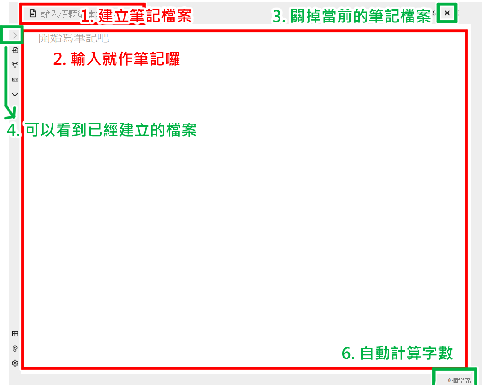
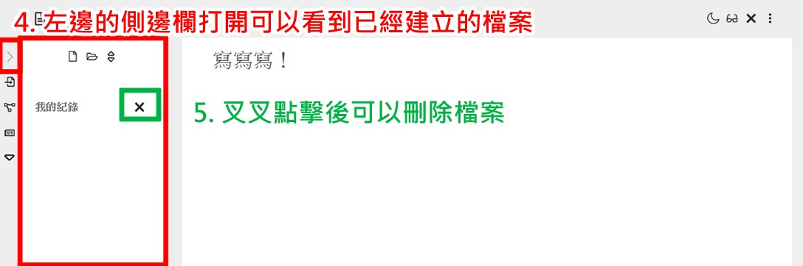

## 【介紹與功能】

簡易的筆記工具，復刻 Obsidian 筆記軟體的樣式，當你瀏覽網頁時突然有需要紀錄的想法點子，不妨打開它，紀錄一下吧！功能如下：

1. 請先輸入標題，當游標為非 focus 狀態，會自動建立筆記檔案。
2. 可以開始作筆記囉，會自動儲存內容於瀏覽器。
3. 右上方的叉叉可以關掉當前的筆記檔案，並且透過步驟 1 就可以重新建立新的筆記檔案。
4. 左邊的側邊欄打開可以看到已經建立的檔案。
5. 左邊側邊欄檔案的叉叉點擊後可以刪除檔案。
6. 右下角會自動計算字數。

**注意事項：**
有功能的 icon 按鈕只有「左邊欄」、右上方的叉叉（可以關閉當前檔案），其餘**皆沒有功能**。

## 【專案網頁點此進入】

https://ziwenying.com/reprint_obsidian/#/main

## 【使用方式】

1. 複製本專案
   git clone https://github.com/ziwenying/reprint_obsidian.git

2. 移動至專案資料夾
   cd reprint_obsidian

3. 安裝所需要的套件
   npm install

4. 在本地啟動專案
   npm run serve

5. 打包專案
   npm run build

# 【採用】

1. vue2
2. scss
